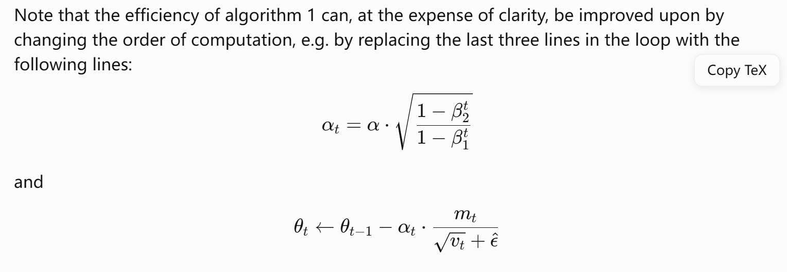
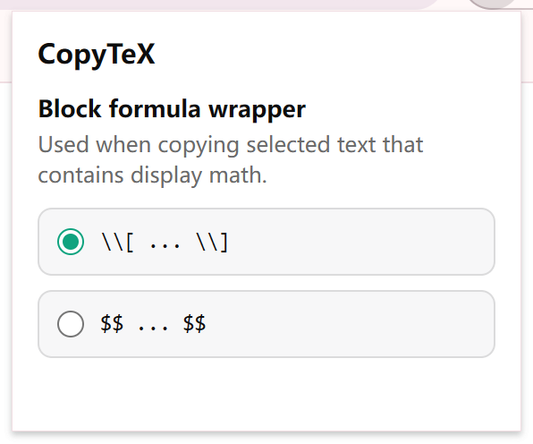

# CopyTeX

An extension that copies raw LaTeX source from KaTeX and MathJax-rendered formulas on supported web pages.

## Preview

  

Hover copy control on a rendered formula.

  

Extension popup for display formula wrapper settings.

## Installation

This extension is only tested on Chrome.

1. Open `chrome://extensions`.
2. Enable Developer mode.
3. Click `Load unpacked`.
4. Select this repository folder.
5. Open or reload a supported site and test on a response containing rendered math.

## Supported Sites

- `https://chatgpt.com/`
- `https://chat.deepseek.com/`
- `https://www.zhihu.com/`
- `https://zhuanlan.zhihu.com/`
